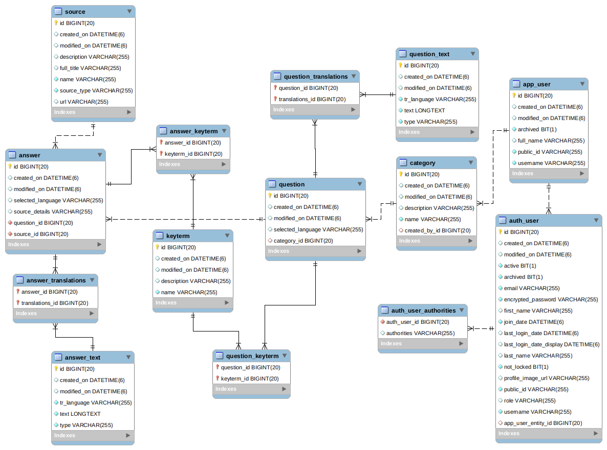

# Knowthenix

_Приложение еще не завершено. Оно находится в процессе доработки._

На других языках:  
* [English](README_en.md)

### Содержание
* [Общая информация](#%D0%BE%D0%B1%D1%89%D0%B0%D1%8F-%D0%B8%D0%BD%D1%84%D0%BE%D1%80%D0%BC%D0%B0%D1%86%D0%B8%D1%8F)
* [Используемые технологии](#%D0%B8%D1%81%D0%BF%D0%BE%D0%BB%D1%8C%D0%B7%D1%83%D0%B5%D0%BC%D1%8B%D0%B5-%D1%82%D0%B5%D1%85%D0%BD%D0%BE%D0%BB%D0%BE%D0%B3%D0%B8%D0%B8)
* [Как запустить приложение](#%D0%BA%D0%B0%D0%BA-%D0%B7%D0%B0%D0%BF%D1%83%D1%81%D1%82%D0%B8%D1%82%D1%8C-%D0%BF%D1%80%D0%B8%D0%BB%D0%BE%D0%B6%D0%B5%D0%BD%D0%B8%D0%B5)
* [Как использовать Front-end](#%D0%BA%D0%B0%D0%BA-%D0%B8%D1%81%D0%BF%D0%BE%D0%BB%D1%8C%D0%B7%D0%BE%D0%B2%D0%B0%D1%82%D1%8C-front-end-2-%D0%B2%D0%B0%D1%80%D0%B8%D0%B0%D0%BD%D1%82%D0%B0)
* [Скриншоты](#%D1%81%D0%BA%D1%80%D0%B8%D0%BD%D1%88%D0%BE%D1%82%D1%8B)
* [Схема БД](#%D1%81%D1%85%D0%B5%D0%BC%D0%B0-%D0%B1%D0%B4)
* [Пользовательские аттрибуты приложения и профили](#%D0%BF%D0%BE%D0%BB%D1%8C%D0%B7%D0%BE%D0%B2%D0%B0%D1%82%D0%B5%D0%BB%D1%8C%D1%81%D0%BA%D0%B8%D0%B5-%D0%B0%D1%82%D1%82%D1%80%D0%B8%D0%B1%D1%83%D1%82%D1%8B-%D0%BF%D1%80%D0%B8%D0%BB%D0%BE%D0%B6%D0%B5%D0%BD%D0%B8%D1%8F-%D0%B8-%D0%BF%D1%80%D0%BE%D1%84%D0%B8%D0%BB%D0%B8)
* [Запросы Curl](#%D0%B7%D0%B0%D0%BF%D1%80%D0%BE%D1%81%D1%8B-curl)

### Общая информация

Приложение предназначено для наполнения Базы Знаний авторизованными пользователями.
Оно поддерживает хранение информации включая возможные варианты Ответов на Вопросы с использованием различных источников.
Текст может быть представлен в виде нескольких переводов на различных языках.
В дальнейшем планируется как источник для генерации записей для системы интервального повторения 
(еще не реализована).

### Используемые технологии
* Back-end
    * Spring Boot
    * Spring Data JPA
    * Spring MVC
    * H2 database
    * PostgreSQL, MySQL (или другая RDBMS)
* Front-end
    * [Knowthenix-ang](https://github.com/dpopkov/knowthenix-ang) - проект на Angular.

### Как запустить приложение
Эта секция еще не завершена. Данные инструкции только для персонального использования.
Нет гарантии получения результата на любой машине.
Нуждаются в дальнейшем тестировании и прояснении.
* Собрать проект: `mvn clean package`
* Создать базу данных в PostgreSQL или MySQL: `create database knowthenix-prod`
* Создать переменные окружения для передачи имени пользователя и пароля в приложение:
    * `KNOWTHENIX_ADMIN=<enter-db-user-name>`
    * `KNOWTHENIX_ADMIN_PASSWORD=<enter-db-user-password>`
* Протестировать соединение с БД используя любой SQL клиент:
    * Postgres: `jdbc:postgresql://localhost:5432/knowthenix-prod`
    * либо MySQL: `jdbc:mysql://localhost:3306/knowthenix-prod?userUnicode=true&characterEncoding=UTF-8&serverTimezone=UTC`
* Запустить в первый раз для наполнения БД первичными данными: 
    * `java -jar knowthenix-X.Y.Z-SNAPSHOT.jar --spring.active.profile=init` или `--spring.active.profile=mysqlinit`
    * после инициализации будет создан пользователь `admin` с паролем `admin`
* Запускать впоследствии после инициализации БД, либо с пустой БД: 
    * `java -jar knowthenix-X.Y.Z-SNAPSHOT.jar --spring.active.profile=prod`
* Использование: 
    * с front-end [Knowthenix-ang](https://github.com/dpopkov/knowthenix-ang).
    * или использовать curl, httpie, Postman или другой http клиент.
    
### Как использовать Front-end (2 варианта)
* Предусловие: Angular CLI уже должен быть установлен.
* 1 - запустить front-end [Knowthenix-ang](https://github.com/dpopkov/knowthenix-ang) на его собственном сервере:
    * перейти в директорию проекта front-end
    * запустить в терминале `ng serve`
    * после старта front-end направить браузер на адрес `http://localhost:4200` (при этом back-end уже должен работать)
    * по окончании работы для остановки сервера front-end можно нажать Ctrl+C в том же терминале
* 2 - используя front-end откомпилированный в обычный javascript:
    * перейти в директорию проекта front-end
    * запустить в терминале `ng build --prod`
    * скопировать все откомпилированный файлы из папки `dist/knowthenix` в папку `src/main/resources/static` данного проекта
    * далее либо запустить приложение используя IDE, либо собрать и запустить jar как обычно
        * Важно: использовать проперти приложения `--app.security.permitall=true`, это временная мера и будет исправлено
    * направить браузер на адрес `http://localhost:8080`

### Скриншоты

Скриншоты взяты из [Knowthenix-ang](https://github.com/dpopkov/knowthenix-ang)

|  |  |
| ------------- | ------------- |
|  |  |
| Страница регистрации. Если пароль не вводится, то он будет сгенерирован. | Страница входа. Количество попыток входа ограничено, после чего аккаунт блокируется. |
|  |  |
| Список всех пользователей. | Сброс пароля пользователя. | 
|  |  |
| Редактирование данных пользователя. | Профиль текущего пользователя. |

Остальные скриншоты для Категорий, Вопросов, Ключевых Терминов и Источников будут добавлены позже.

### Схема БД
Диаграмма сгенерирована в MySQL Workbench и не является окончательной.

### Пользовательские аттрибуты приложения и профили
Будет добавлена позже.

### Запросы Curl
Будет добавлена позже.

[Наверх](#knowthenix)
